# PitchBook Futsal Booking Platform - Diagrams

This document contains the UI and State diagrams for the PitchBook futsal booking platform.

## 1. UI Diagram

```mermaid
graph TB
    %% Main Application Structure
    App[App.tsx] --> AuthProvider[AuthProvider]
    AuthProvider --> NotificationsProvider[NotificationsProvider]
    NotificationsProvider --> AppRoutes[AppRoutes]
    
    %% Route Protection and Layouts
    AppRoutes --> RouteProtection[RouteProtection]
    AppRoutes --> MainLayout[MainLayout]
    AppRoutes --> SidebarLayout[SidebarLayout]
    
    %% Public Routes
    MainLayout --> LandingPage[LandingPage]
    MainLayout --> ExploreFutsalsPage[ExploreFutsalsPage]
    MainLayout --> FutsalDetailsPage[FutsalDetailsPage]
    MainLayout --> GamesPage[GamesPage]
    MainLayout --> ContactUsPage[ContactUsPage]
    MainLayout --> PaymentVerificationPage[PaymentVerificationPage]
    
    %% Auth Routes
    AppRoutes --> Login[Login]
    AppRoutes --> Register[Register]
    AppRoutes --> ForgotStatus[ForgotStatus]
    AppRoutes --> ResetPassword[ResetPassword]
    
    %% Admin Routes (Protected)
    RouteProtection --> AdminDashboard[AdminDashboard]
    RouteProtection --> AdminUsers[AdminUsers]
    RouteProtection --> AdminFutsals[AdminFutsals]
    RouteProtection --> AdminBookings[AdminBookings]
    RouteProtection --> AdminTransactions[AdminTransactions]
    RouteProtection --> AdminReports[AdminReports]
    RouteProtection --> AdminSettings[AdminSettings]
    
    %% Futsal Owner Routes (Protected)
    RouteProtection --> FutsalOwnerDashboard[FutsalOwnerDashboard]
    RouteProtection --> FutsalOwnerBookings[FutsalOwnerBookings]
    RouteProtection --> FutsalOwnerFutsal[FutsalOwnerFutsal]
    RouteProtection --> FutsalOwnerTransactions[FutsalOwnerTransactions]
    
    %% Landing Page Components
    LandingPage --> HeroSection[HeroSection]
    LandingPage --> IntroSection[IntroSection]
    LandingPage --> FeaturesSection[FeaturesSection]
    LandingPage --> TestimonialsSection[TestimonialsSection]
    LandingPage --> FAQSection[FAQSection]
    
    %% Futsals Components
    ExploreFutsalsPage --> FutsalCard[FutsalCard]
    FutsalDetailsPage --> BookingDialog[BookingDialog]
    FutsalDetailsPage --> PaymentDialog[PaymentDialog]
    FutsalDetailsPage --> ShareDialog[ShareDialog]
    FutsalDetailsPage --> BulkBookingDialog[BulkBookingDialog]
    FutsalDetailsPage --> MapModal[MapModal]
    FutsalDetailsPage --> ReviewForm[ReviewForm]
    
    %% Games Components
    GamesPage --> FutsalSelectionPage[FutsalSelectionPage]
    GamesPage --> PartialBookingCard[PartialBookingCard]
    
    %% Layout Components
    MainLayout --> Header[Header]
    SidebarLayout --> Sidebar[Sidebar]
    SidebarLayout --> TopBar[TopBar]
    
    %% Header Components
    Header --> Navigation[Navigation]
    Header --> UserMenu[UserMenu]
    Header --> Notifications[Notifications]
    Header --> FavoritesDialog[FavoritesDialog]
    Header --> UserBookingsDialog[UserBookingsDialog]
    
    %% Admin Dashboard Components
    AdminDashboard --> OverviewTab[OverviewTab]
    AdminDashboard --> TopFutsalsTab[TopFutsalsTab]
    AdminDashboard --> TopUsersTab[TopUsersTab]
    AdminDashboard --> UserManagementTab[UserManagementTab]
    AdminDashboard --> FutsalManagementTab[FutsalManagementTab]
    AdminDashboard --> LowPerformingTab[LowPerformingTab]
    AdminDashboard --> LocationsTab[LocationsTab]
    AdminDashboard --> AnalyticsTab[AnalyticsTab]
    
    %% Futsal Owner Dashboard Components
    FutsalOwnerDashboard --> StatCards[StatCards]
    FutsalOwnerDashboard --> TodayStats[TodayStats]
    FutsalOwnerDashboard --> TodaysSchedule[TodaysSchedule]
    FutsalOwnerDashboard --> RecentNotifications[RecentNotifications]
    
    %% Error Pages
    AppRoutes --> Unauthorized[Unauthorized]
    
    %% Styling
    classDef publicRoute fill:#e1f5fe
    classDef protectedRoute fill:#fff3e0
    classDef authRoute fill:#f3e5f5
    classDef component fill:#e8f5e8
    classDef layout fill:#fce4ec
    
    class LandingPage,ExploreFutsalsPage,FutsalDetailsPage,GamesPage,ContactUsPage,PaymentVerificationPage publicRoute
    class AdminDashboard,AdminUsers,AdminFutsals,AdminBookings,AdminTransactions,AdminReports,AdminSettings,FutsalOwnerDashboard,FutsalOwnerBookings,FutsalOwnerFutsal,FutsalOwnerTransactions protectedRoute
    class Login,Register,ForgotStatus,ResetPassword authRoute
    class HeroSection,IntroSection,FeaturesSection,TestimonialsSection,FAQSection,FutsalCard,BookingDialog,PaymentDialog,ShareDialog,BulkBookingDialog,MapModal,ReviewForm,PartialBookingCard component
    class MainLayout,SidebarLayout,Header,Sidebar,TopBar,Navigation,UserMenu,Notifications,FavoritesDialog,UserBookingsDialog layout
```

## 2. State Diagram

```mermaid
stateDiagram-v2
    [*] --> Unauthenticated
    
    %% Authentication States
    Unauthenticated --> Login
    Unauthenticated --> Register
    Unauthenticated --> LandingPage
    
    Login --> Authenticating
    Register --> Registering
    Authenticating --> Authenticated
    Registering --> Authenticated
    Authenticating --> LoginError
    Registering --> RegisterError
    LoginError --> Login
    RegisterError --> Register
    
    %% Role-based Navigation
    Authenticated --> CustomerDashboard
    Authenticated --> AdminDashboard
    Authenticated --> FutsalOwnerDashboard
    
    %% Customer User Flow
    CustomerDashboard --> BrowseFutsals
    CustomerDashboard --> GamesPage
    CustomerDashboard --> UserProfile
    
    BrowseFutsals --> FutsalDetails
    FutsalDetails --> BookingFlow
    FutsalDetails --> AddToFavorites
    FutsalDetails --> WriteReview
    FutsalDetails --> ShareFutsal
    
    BookingFlow --> SelectDateTime
    SelectDateTime --> ValidateSlot
    ValidateSlot --> PaymentFlow
    ValidateSlot --> SlotError
    SlotError --> SelectDateTime
    
    PaymentFlow --> KhaltiPayment
    KhaltiPayment --> PaymentVerification
    PaymentVerification --> BookingConfirmed
    PaymentVerification --> PaymentFailed
    PaymentFailed --> PaymentFlow
    
    %% Partial Booking Flow
    GamesPage --> HostGame
    GamesPage --> JoinGame
    HostGame --> FutsalSelection
    FutsalSelection --> PartialBookingFlow
    PartialBookingFlow --> GameCreated
    JoinGame --> GameJoined
    
    %% Admin User Flow
    AdminDashboard --> UserManagement
    AdminDashboard --> FutsalManagement
    AdminDashboard --> BookingManagement
    AdminDashboard --> TransactionManagement
    AdminDashboard --> Reports
    AdminDashboard --> Settings
    
    UserManagement --> ViewUsers
    UserManagement --> EditUser
    UserManagement --> DeleteUser
    
    FutsalManagement --> ViewFutsals
    FutsalManagement --> ApproveFutsal
    FutsalManagement --> RejectFutsal
    FutsalManagement --> EditFutsal
    
    BookingManagement --> ViewBookings
    BookingManagement --> CancelBooking
    BookingManagement --> RefundBooking
    
    %% Futsal Owner User Flow
    FutsalOwnerDashboard --> ViewBookings
    FutsalOwnerDashboard --> ManageFutsal
    FutsalOwnerDashboard --> ViewTransactions
    FutsalOwnerDashboard --> ViewAnalytics
    
    ManageFutsal --> EditFutsalInfo
    ManageFutsal --> UpdatePricing
    ManageFutsal --> UpdateOperatingHours
    ManageFutsal --> UploadImages
    
    ViewBookings --> ConfirmBooking
    ViewBookings --> CancelBooking
    ViewBookings --> ViewBookingDetails
    
    %% Common States
    BookingConfirmed --> CustomerDashboard
    GameCreated --> GamesPage
    GameJoined --> GamesPage
    
    %% Error States
    PaymentFailed --> CustomerDashboard
    SlotError --> CustomerDashboard
    
    %% Logout Flow
    CustomerDashboard --> Logout
    AdminDashboard --> Logout
    FutsalOwnerDashboard --> Logout
    Logout --> Unauthenticated
    
    %% State Descriptions
    note right of Unauthenticated
        User not logged in
        Can access public pages
    end note
    
    note right of Authenticated
        User logged in
        Role-based access control
    end note
    
    note right of CustomerDashboard
        Customer home page
        Access to futsals, games, profile
    end note
    
    note right of AdminDashboard
        Admin control panel
        User, futsal, booking management
    end note
    
    note right of FutsalOwnerDashboard
        Futsal owner dashboard
        Booking management, analytics
    end note
    
    note right of BookingFlow
        Date/time selection
        Slot validation
        Payment processing
    end note
    
    note right of PaymentFlow
        Khalti integration
        Payment verification
        Booking confirmation
    end note
```

## Platform Overview

### **Customer Side Features:**
1. **Landing Page** - Hero section, features, testimonials, FAQ
2. **Futsal Exploration** - Browse, search, filter futsals
3. **Futsal Details** - View details, book slots, write reviews
4. **Games** - Host/join partial bookings, find players
5. **Booking System** - Full/partial bookings with payment
6. **Favorites** - Save preferred futsals
7. **Reviews** - Rate and review futsals

### **Admin Side Features:**
1. **Dashboard** - Analytics, overview, system health
2. **User Management** - View, edit, delete users
3. **Futsal Management** - Approve, reject, edit futsals
4. **Booking Management** - Monitor all bookings
5. **Transactions** - Payment tracking
6. **Reports** - Analytics and insights
7. **Settings** - System configuration

### **Futsal Owner Side Features:**
1. **Dashboard** - Revenue, bookings, notifications
2. **Bookings** - Manage incoming bookings
3. **Futsal Management** - Update info, pricing, hours
4. **Transactions** - Payment history
5. **Analytics** - Performance metrics

### **Technical Architecture:**
- **Frontend**: React with TypeScript
- **State Management**: Zustand, React Context
- **Routing**: React Router DOM
- **UI Components**: Radix UI, Tailwind CSS
- **Payment**: Khalti integration
- **Real-time**: WebSocket connections
- **Authentication**: JWT tokens with role-based access
- **Maps**: Leaflet integration
- **Forms**: React Hook Form with Zod validation 